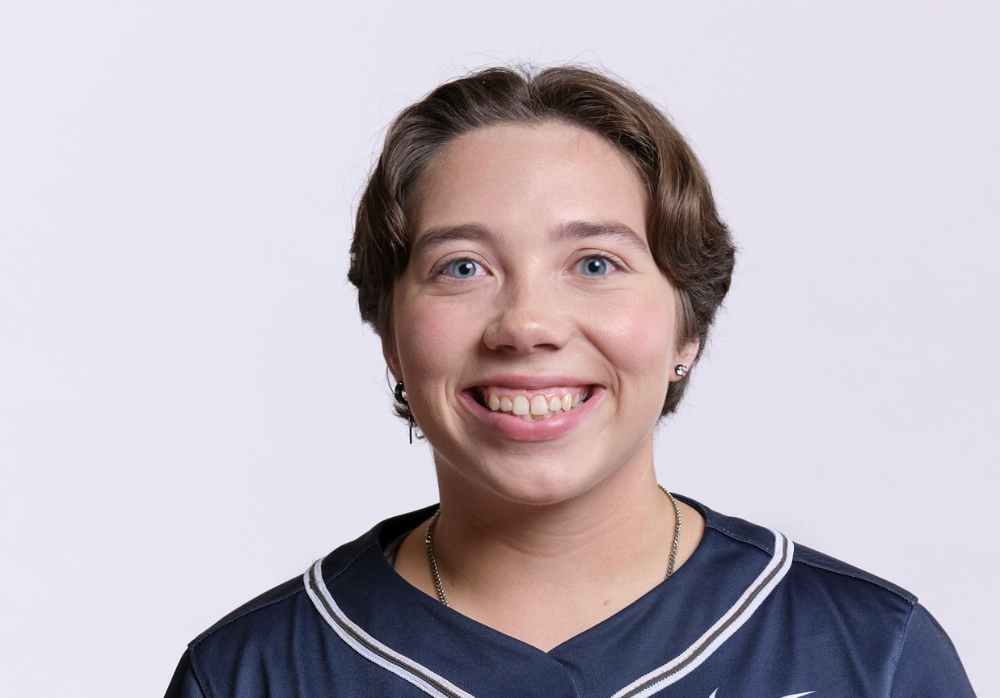

```{=html}
<div style="text-align: center; padding: 2.5rem 0 1.5rem;">
  
  <h1 style="margin: 1.2rem 0 0.2rem; font-size: 2.2rem;">Zoe Doherty</h1>
  <p style="color: #555; font-size: 1.05rem; margin: 0;">Computer Science & Data Science · Lawrence University '26</p>
  <div style="margin-top: 1rem; display: flex; justify-content: center; gap: 12px; flex-wrap: wrap;">
    <a href="https://github.com/ZDoherty31" target="_blank"
       style="display:inline-flex; align-items:center; gap:6px; padding: 7px 16px; border: 1.5px solid #1a3a5c; border-radius: 6px; color: #1a3a5c; font-size: 0.9rem; font-weight: 500; text-decoration: none;">
      <i class="bi bi-github"></i> GitHub
    </a>
    <a href="https://www.linkedin.com/in/zoe-doherty31" target="_blank"
       style="display:inline-flex; align-items:center; gap:6px; padding: 7px 16px; border: 1.5px solid #1a3a5c; border-radius: 6px; color: #1a3a5c; font-size: 0.9rem; font-weight: 500; text-decoration: none;">
      <i class="bi bi-linkedin"></i> LinkedIn
    </a>
  </div>
</div>
```

---

## About Me

Hi, I'm Zoe! I am a student-athlete at **Lawrence University** graduating in June 2026 with a degree in **Computer Science** and a minor in **Data Science** — with departmental honors. I'm originally from Algonquin, Illinois.

I'm passionate about **sports analytics** and love exploring the intersection of data and real-world decision-making. Whether I'm building a relational database, running a sentiment analysis, or finding patterns in a dataset, I enjoy turning raw data into meaningful stories.

Outside of academics, you'll find me on the **softball** field, out on a **hiking** trail, spending time with family and friends, or **drawing**.

---

## Education

**Lawrence University** · Appleton, WI  
B.A. Computer Science, Minor in Data Science · *Class of June 2026*  
Graduating with Departmental Honors